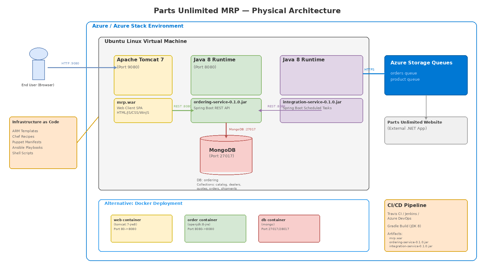
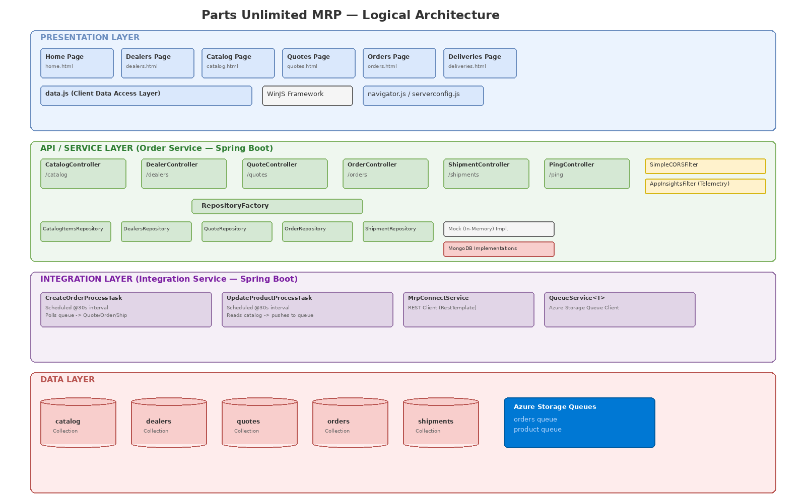
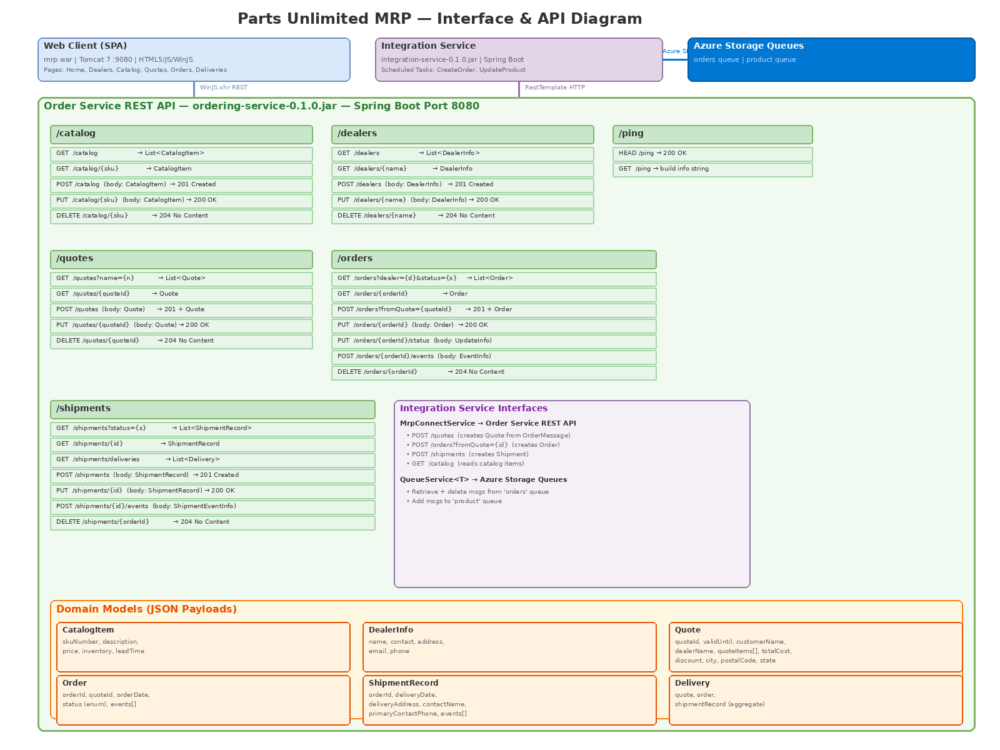
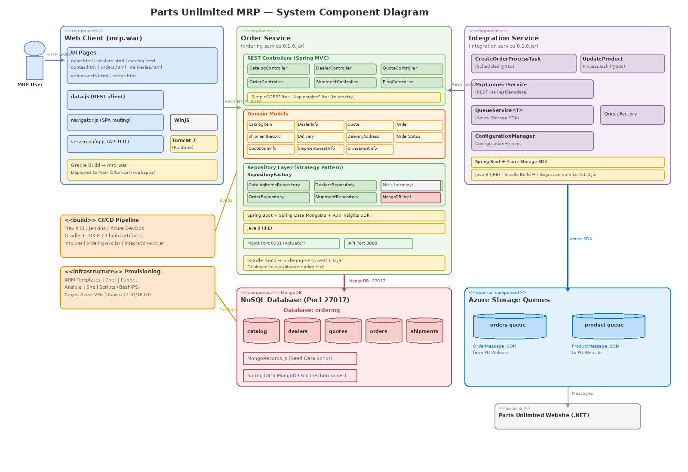

# Parts Unlimited MRP — Solution Architecture Document

**Version:** 1.0  
**Date:** 2026-03-11  
**Repository:** PartsUnlimitedMRP  

---

## Table of Contents

1. [Executive Summary](#1-executive-summary)
2. [System Overview](#2-system-overview)
3. [Physical Architecture](#3-physical-architecture)
4. [Logical Architecture](#4-logical-architecture)
5. [Interface & API Design](#5-interface--api-design)
6. [System Component Diagram](#6-system-component-diagram)
7. [Data Model](#7-data-model)
8. [Technology Stack](#8-technology-stack)
9. [Deployment Architecture](#9-deployment-architecture)
10. [CI/CD Pipeline](#10-cicd-pipeline)
11. [Infrastructure as Code](#11-infrastructure-as-code)
12. [Security Considerations](#12-security-considerations)
13. [Cross-Cutting Concerns](#13-cross-cutting-concerns)
14. [Appendices](#14-appendices)

---

## 1. Executive Summary

Parts Unlimited MRP is a fictional Manufacturing Resource Planning (MRP) application designed as a training platform based on "The Phoenix Project" by Gene Kim, Kevin Behr, and George Spafford. It models a web-based MRP system for the fictional company "Parts Unlimited" (a Fabrikam subsidiary).

The application is built on an entirely open-source stack (Linux, Java, Apache Tomcat, MongoDB) and consists of three main services: a **Web Client** (single-page application), an **Order Service** (REST API backend), and an **Integration Service** (message-driven bridge to the Parts Unlimited website). It serves as a reference implementation for DevOps practices including CI/CD, Infrastructure as Code, and configuration management.

---

## 2. System Overview

### 2.1 Business Context

The MRP system manages the complete lifecycle of manufacturing resource planning:

| Business Domain | Description |
|---|---|
| **Catalog Management** | Maintain parts/product catalog with SKU, pricing, and inventory |
| **Dealer Management** | Track dealer contact information |
| **Quote Management** | Create and track customer quotes with line items |
| **Order Management** | Create orders from quotes, track status through lifecycle |
| **Shipment & Delivery** | Manage shipment records, delivery addresses, and tracking events |
| **Website Integration** | Bi-directional message bridge with the Parts Unlimited e-commerce website |

### 2.2 Key Actors

| Actor | Description |
|---|---|
| **MRP User** | Internal staff managing dealers, catalog, quotes, orders, and deliveries via web UI |
| **Parts Unlimited Website** | External .NET e-commerce application that sends orders and receives catalog updates |
| **CI/CD System** | Automated build and deployment pipeline |
| **Infrastructure Operator** | Provisions and configures the hosting environment |

### 2.3 System Boundaries

The MRP system boundary encompasses:
- The web client front-end
- The Order Service REST API and its MongoDB datastore
- The Integration Service and its Azure Storage Queue connections

External systems include:
- The Parts Unlimited e-commerce website (.NET application)
- Azure Storage (queue messaging infrastructure)
- Azure/Azure Stack hosting platform

---

## 3. Physical Architecture

### Diagram



> **Draw.io source:** [diagrams/01-physical-architecture.drawio](diagrams/01-physical-architecture.drawio)

### 3.1 Infrastructure Components

| Component | Technology | Port | Role |
|---|---|---|---|
| **Web Server** | Apache Tomcat 7 | 9080 | Hosts the WAR-packaged web client SPA |
| **Order Service** | Java 8 (standalone JAR) | 8080 (API), 8081 (management) | Serves the REST API, connects to MongoDB |
| **Integration Service** | Java 8 (standalone JAR) | — | Background scheduled tasks; no inbound port |
| **Database** | MongoDB | 27017 | Stores all domain data in the `ordering` database |
| **Message Broker** | Azure Storage Queues | HTTPS | Asynchronous messaging between MRP and PU Website |

### 3.2 Hosting Environment

**Primary deployment:** Single Ubuntu Linux Virtual Machine hosted on Azure or Azure Stack.

All three application components (Tomcat, Order Service, Integration Service) and MongoDB run on the same VM. The deployment script (`deploy/deploy_mrp_app.sh`) performs the following:

1. Copies artifacts (`mrp.war`, `ordering-service-0.1.0.jar`) to `/var/lib/partsunlimited/`
2. Seeds MongoDB with `MongoRecords.js`
3. Changes Tomcat listening port from 8080 to 9080 (to avoid conflict with Order Service)
4. Deploys `mrp.war` to Tomcat's webapps directory
5. Starts the Order Service as a background Java process

### 3.3 Alternative Docker Deployment

A Docker-based deployment is provided with three containers:

| Container | Base Image | Port Mapping | Links |
|---|---|---|---|
| `web` | `tomcat:7-jre8` | 80 → 8080 | — |
| `order` | `openjdk:8-jre` | 8080 → 8080 | `db:mongo` |
| `db` | `mongo` | 27017, 28017 | — |

Build and run via `deploy/docker/BuildAndRun.sh`.

### 3.4 Network Topology

```
End User (Browser)
    │
    │ HTTP :9080
    ▼
┌─────────────────────────────────────────────────────┐
│  Ubuntu Linux VM                                     │
│                                                      │
│  ┌──────────────┐    REST :8080    ┌──────────────┐ │
│  │  Tomcat 7    │ ──────────────▶  │ Order Service│ │
│  │  (mrp.war)   │                  │ (Spring Boot)│ │
│  │  Port 9080   │                  │  Port 8080   │ │
│  └──────────────┘                  └──────┬───────┘ │
│                                           │         │
│  ┌──────────────┐   REST :8080            │ MongoDB │
│  │  Integration │ ────────────────┘       │ :27017  │
│  │  Service     │                  ┌──────▼───────┐ │
│  │  (Scheduled) │                  │   MongoDB    │ │
│  └───────┬──────┘                  │  (ordering)  │ │
│          │                         └──────────────┘ │
└──────────┼──────────────────────────────────────────┘
           │ HTTPS (Azure SDK)
           ▼
   ┌───────────────┐        ┌───────────────────────┐
   │ Azure Storage │◄──────▶│ Parts Unlimited        │
   │ Queues        │        │ Website (.NET)         │
   │ (orders,      │        │ (External System)      │
   │  product)     │        └───────────────────────┘
   └───────────────┘
```

---

## 4. Logical Architecture

### Diagram



> **Draw.io source:** [diagrams/02-logical-architecture.drawio](diagrams/02-logical-architecture.drawio)

### 4.1 Layered Architecture

The system follows a classic N-tier architecture:

#### Layer 1: Presentation Layer

| Component | Technology | Description |
|---|---|---|
| **UI Pages** | HTML5 / CSS3 | Six main views: Home, Dealers, Catalog, Quotes, Orders, Deliveries |
| **WinJS Framework** | JavaScript (WinJS 4.x) | SPA framework providing UI controls, data binding, navigation |
| **data.js** | JavaScript | Client-side data access layer; all REST API calls via `WinJS.xhr()` |
| **navigator.js** | JavaScript | Client-side page navigation (SPA router) |
| **serverconfig.js** | JavaScript | API base URL configuration: `http://<host>:8080` |

#### Layer 2: API / Service Layer (Order Service)

| Component | Type | Description |
|---|---|---|
| **CatalogController** | REST Controller | CRUD for catalog items (by SKU) |
| **DealerController** | REST Controller | CRUD for dealer contact records |
| **QuoteController** | REST Controller | CRUD for customer quotes |
| **OrderController** | REST Controller | Order lifecycle management (create from quote, update status, events) |
| **ShipmentController** | REST Controller | Shipment/delivery management |
| **PingController** | REST Controller | Health check and build info endpoint |
| **SimpleCORSFilter** | Servlet Filter | Cross-origin request support |
| **AppInsightsFilter** | Servlet Filter | Application Insights telemetry |

#### Layer 3: Repository Layer (Order Service)

Uses the **Strategy Pattern** via `RepositoryFactory` to switch between:

- **Mock (In-Memory) Repositories** — for testing without MongoDB
- **MongoDB Repositories** — for production with Spring Data MongoDB

| Repository Interface | Mock Implementation | MongoDB Implementation |
|---|---|---|
| `CatalogItemsRepository` | `MockCatalogItemsRepository` | `MongoCatalogItemsRepository` |
| `DealersRepository` | `MockDealersRepository` | `MongoDealersRepository` |
| `QuoteRepository` | `MockQuoteRepository` | `MongoQuoteRepository` |
| `OrderRepository` | `MockOrderRepository` | `MongoOrderRepository` |
| `ShipmentRepository` | `MockShipmentRepository` | `MongoShipmentRepository` |

Storage selection configured via `ordering.storage` property (`memory` or `mongodb`).

#### Layer 4: Integration Layer (Integration Service)

| Component | Schedule | Description |
|---|---|---|
| **CreateOrderProcessTask** | Every 30 seconds | Polls Azure `orders` queue for new order messages from the PU Website; for each message: creates a Quote → Order → Shipment via Order Service REST API |
| **UpdateProductProcessTask** | Every 30 seconds | Queries the Order Service catalog API; pushes a ProductMessage to the Azure `product` queue for the PU Website |
| **MrpConnectService** | On-demand | REST client (Spring `RestTemplate`) that communicates with the Order Service API |
| **QueueService\<T\>** | On-demand | Generic Azure Storage Queue client for reading/writing JSON messages |

#### Layer 5: Data Layer

| Store | Type | Description |
|---|---|---|
| **MongoDB** (`ordering` database) | Document store | Five collections: `catalog`, `dealers`, `quotes`, `orders`, `shipments` |
| **Azure Storage Queues** | Message queue | Two queues: `orders` (inbound from website), `product` (outbound to website) |

---

## 5. Interface & API Design

### Diagram



> **Draw.io source:** [diagrams/03-interface-diagram.drawio](diagrams/03-interface-diagram.drawio)

### 5.1 Order Service REST API (Port 8080)

All endpoints accept and return JSON (`Content-Type: application/json`).

#### `/catalog` — Catalog Management

| Method | Path | Request Body | Response | Description |
|---|---|---|---|---|
| `GET` | `/catalog` | — | `200` List\<CatalogItem\> | List all catalog items |
| `GET` | `/catalog/{sku}` | — | `200` CatalogItem | Get item by SKU |
| `POST` | `/catalog` | CatalogItem | `201` Created | Add new catalog item |
| `PUT` | `/catalog/{sku}` | CatalogItem | `200` OK | Update existing item |
| `DELETE` | `/catalog/{sku}` | — | `204` No Content | Remove item |

#### `/dealers` — Dealer Management

| Method | Path | Request Body | Response | Description |
|---|---|---|---|---|
| `GET` | `/dealers` | — | `200` List\<DealerInfo\> | List all dealers |
| `GET` | `/dealers/{name}` | — | `200` DealerInfo | Get dealer by name |
| `POST` | `/dealers` | DealerInfo | `201` Created | Add new dealer |
| `PUT` | `/dealers/{name}` | DealerInfo | `200` OK | Update dealer |
| `DELETE` | `/dealers/{name}` | — | `204` No Content | Remove dealer |

#### `/quotes` — Quote Management

| Method | Path | Request Body | Response | Description |
|---|---|---|---|---|
| `GET` | `/quotes?name={n}` | — | `200` List\<Quote\> | Search quotes by customer name |
| `GET` | `/quotes/{quoteId}` | — | `200` Quote | Get quote by ID |
| `POST` | `/quotes` | Quote | `201` Quote | Create new quote |
| `PUT` | `/quotes/{quoteId}` | Quote | `200` OK | Update quote |
| `DELETE` | `/quotes/{quoteId}` | — | `204` No Content | Remove quote |

#### `/orders` — Order Management

| Method | Path | Request Body | Response | Description |
|---|---|---|---|---|
| `GET` | `/orders?dealer={d}&status={s}` | — | `200` List\<Order\> | List orders by dealer/status |
| `GET` | `/orders/{orderId}` | — | `200` Order | Get order by ID |
| `POST` | `/orders?fromQuote={quoteId}` | — | `201` Order | Create order from existing quote |
| `PUT` | `/orders/{orderId}` | Order | `200` OK | Update order |
| `PUT` | `/orders/{orderId}/status` | OrderUpdateInfo | `200` OK | Update order status |
| `POST` | `/orders/{orderId}/events` | OrderEventInfo | `201` Created | Add event to order |
| `DELETE` | `/orders/{orderId}` | — | `204` No Content | Delete order |

#### `/shipments` — Shipment Management

| Method | Path | Request Body | Response | Description |
|---|---|---|---|---|
| `GET` | `/shipments?status={s}` | — | `200` List\<ShipmentRecord\> | List shipments by status |
| `GET` | `/shipments/{id}` | — | `200` ShipmentRecord | Get shipment by order ID |
| `GET` | `/shipments/deliveries` | — | `200` List\<Delivery\> | Get confirmed deliveries (aggregate) |
| `POST` | `/shipments` | ShipmentRecord | `201` Created | Create shipment |
| `PUT` | `/shipments/{id}` | ShipmentRecord | `200` OK | Update shipment |
| `POST` | `/shipments/{id}/events` | ShipmentEventInfo | `200` OK | Add tracking event |
| `DELETE` | `/shipments/{orderId}` | — | `204` No Content | Delete shipment |

#### `/ping` — Health Check

| Method | Path | Response | Description |
|---|---|---|---|
| `HEAD` | `/ping` | `200` OK | Simple health check |
| `GET` | `/ping` | `200` String | Returns config message + build info |

### 5.2 Integration Service Interfaces

The Integration Service communicates via two interfaces:

**Interface 1: MrpConnectService → Order Service REST API**

| Operation | HTTP Call | Purpose |
|---|---|---|
| `createQuote()` | `POST /quotes` | Creates a Quote from an OrderMessage |
| `createOrder()` | `POST /orders?fromQuote={id}` | Creates an Order from the Quote |
| `createShipment()` | `POST /shipments` | Creates a Shipment for the Order |
| `getCatalogItems()` | `GET /catalog` | Retrieves the full product catalog |

**Interface 2: QueueService → Azure Storage Queues**

| Operation | Queue | Message Type | Direction |
|---|---|---|---|
| `getQueueMessage()` | `orders` | OrderMessage (JSON) | Read from queue |
| `deleteQueueMessage()` | `orders` | — | Delete processed message |
| `addQueueMessage()` | `product` | ProductMessage (JSON) | Write to queue |

### 5.3 Client-to-API Interface

The web client (`data.js`) communicates with the Order Service API using `WinJS.xhr()` with:
- **Headers:** `Content-Type: application/json`, `Pragma: no-cache`, `Cache-Control: no-cache`
- **Base URL:** Configured in `serverconfig.js` as `http://<hostname>:8080`
- **Operations:** Full CRUD for all resources (dealers, catalog, quotes, orders, deliveries/shipments)

---

## 6. System Component Diagram

### Diagram



> **Draw.io source:** [diagrams/04-system-component-diagram.drawio](diagrams/04-system-component-diagram.drawio)

### 6.1 Component Breakdown

#### Web Client Component (`mrp.war`)

| Sub-component | File(s) | Responsibility |
|---|---|---|
| UI Pages | `pages/*/[name].html` + `.css` + `.js` | View rendering and user interaction |
| Data Layer | `js/data.js` | All REST API communication via WinJS.xhr |
| SPA Router | `js/navigator.js` | Page navigation without full reload |
| Config | `js/serverconfig.js` | API base URL |
| UI Framework | `winjs/` | WinJS library (binding, controls, navigation) |
| Edit Controls | `controls/edittools/` | Reusable edit toolbar component |
| Runtime | Apache Tomcat 7 | Servlet container serving the WAR |

#### Order Service Component (`ordering-service-0.1.0.jar`)

| Sub-component | Package | Responsibility |
|---|---|---|
| REST Controllers | `smpl.ordering.controllers` | 6 controllers handling all REST endpoints |
| Domain Models | `smpl.ordering.models` | 12 model classes (CatalogItem, Order, Quote, etc.) |
| Repository Interfaces | `smpl.ordering.repositories` | 5 abstract repositories + RepositoryFactory |
| Mock Repositories | `smpl.ordering.repositories.mock` | In-memory implementations for testing |
| MongoDB Repositories | `smpl.ordering.repositories.mongodb` | Production implementations with Spring Data |
| MongoDB Models | `smpl.ordering.repositories.mongodb.models` | MongoDB-specific document models |
| Cross-Cutting | `smpl.ordering` | CORS filter, AppInsights filter, configuration |
| Runtime | Spring Boot + Embedded Tomcat | Application framework and HTTP server |
| Management | Spring Boot Actuator | Health/info endpoints on port 8081 |

#### Integration Service Component (`integration-service-0.1.0.jar`)

| Sub-component | Package | Responsibility |
|---|---|---|
| Scheduled Tasks | `integration.scheduled` | Two @Scheduled tasks (30s interval each) |
| MRP Connector | `integration.services.MrpConnectService` | REST client to Order Service API |
| Queue Service | `integration.services.QueueService<T>` | Generic Azure Storage Queue client |
| Queue Factory | `integration.services.QueueFactory` | Azure CloudQueue instance factory |
| Configuration | `integration.infrastructure` | Property-based configuration manager |
| MRP Models | `integration.models.mrp` | MRP domain model mirrors |
| Website Models | `integration.models.website` | PU Website message models |
| Runtime | Spring Boot | Application framework with scheduling |

#### MongoDB Component

| Element | Description |
|---|---|
| Database | `ordering` |
| Collections | `catalog`, `dealers`, `quotes`, `orders`, `shipments` |
| Seed Script | `deploy/MongoRecords.js` — 18 catalog items, 1 dealer, 3 quotes, 2 orders, 2 shipments |

#### Azure Storage Queues Component (External)

| Queue | Message Format | Producer | Consumer |
|---|---|---|---|
| `orders` | OrderMessage JSON | PU Website | Integration Service |
| `product` | ProductMessage JSON | Integration Service | PU Website |

---

## 7. Data Model

### 7.1 MongoDB Collections

#### `catalog` Collection
```json
{
  "skuNumber": "LIG-0001",
  "description": "Helogen Headlights (2 Pack)",
  "price": 38.99,
  "inventory": 10,
  "leadTime": 3
}
```

#### `dealers` Collection
```json
{
  "name": "Terry Adams",
  "address": "17760 Northeast 67th Court, Redmond, WA 98052",
  "email": "terry@adams.com",
  "phone": "425-885-6217"
}
```

#### `quotes` Collection
```json
{
  "quoteId": "0",
  "validUntil": "2015-05-01T00:00:00+0000",
  "customerName": "Walter Harp",
  "dealerName": "Terry Adams",
  "city": "Seattle",
  "totalCost": "51.97",
  "discount": "0.0",
  "state": "WA",
  "postalCode": "98023",
  "quoteItems": [
    { "skuNumber": "LIG-0001", "amount": 1 },
    { "skuNumber": "LIG-0003", "amount": 2 }
  ]
}
```

#### `orders` Collection
```json
{
  "orderId": "0",
  "quoteId": "0",
  "orderDate": "2015-03-02T20:43:37+0000",
  "status": "Created",
  "events": []
}
```

**Order Status Lifecycle:**
`None` → `Created` → `Confirmed` → `Started` → `Built` → `DeliveryConfirmed` → `Shipped` → `Delivered` → `Installed`

#### `shipments` Collection
```json
{
  "orderId": "0",
  "contactName": "Walter Harp",
  "primaryContactPhone": {
    "phoneNumber": "435-783-2378",
    "kind": "Mobile"
  },
  "deliveryAddress": {
    "street": "34 Sheridan Street",
    "city": "Seattle",
    "state": "WA",
    "postalCode": "98023",
    "specialInstructions": ""
  },
  "events": []
}
```

### 7.2 Entity Relationships

```
DealerInfo ─────┐
                 │ dealerName
CatalogItem ─┐  ▼
   skuNumber │  Quote
             │    │ quoteId
             │    ▼
             │  Order ──────▶ ShipmentRecord
             │    │ orderId      │ orderId
             │    │              │
             │    ▼              ▼
             │  OrderEventInfo  ShipmentEventInfo
             │
             └──▶ QuoteItemInfo
                    (skuNumber + amount)
```

### 7.3 Queue Message Models

**OrderMessage** (from PU Website → `orders` queue):
- Contains customer details and ordered items from the e-commerce website

**ProductMessage** (from Integration Service → `product` queue):
- Contains the full catalog item list from the MRP system

---

## 8. Technology Stack

### 8.1 Runtime Technologies

| Layer | Technology | Version |
|---|---|---|
| **Frontend Framework** | WinJS | 4.x |
| **Frontend Runtime** | Apache Tomcat | 7 |
| **Backend Framework** | Spring Boot | 1.x |
| **Backend Language** | Java | 8 (Oracle JDK) |
| **Database** | MongoDB | 3.x+ |
| **Message Queue** | Azure Storage Queues | — |
| **Telemetry** | Microsoft Application Insights | — |
| **Cloud SDK** | Azure Storage SDK for Java | — |

### 8.2 Build Technologies

| Tool | Purpose |
|---|---|
| **Gradle** | Build automation (3 independent Gradle projects) |
| **JDK 8** | Compilation |
| **Travis CI** | Continuous integration |
| **Jenkins** | Alternative CI/CD |
| **Azure DevOps** | Alternative CI/CD |

### 8.3 Build Artifacts

| Artifact | Source | Technology |
|---|---|---|
| `mrp.war` | `src/Clients/` | Gradle WAR build; HTML/JS/CSS packaged for Tomcat |
| `ordering-service-0.1.0.jar` | `src/Backend/OrderService/` | Gradle Spring Boot JAR |
| `integration-service-0.1.0.jar` | `src/Backend/IntegrationService/` | Gradle Spring Boot JAR |

---

## 9. Deployment Architecture

### 9.1 Traditional VM Deployment

**Prerequisites (installed via `deploy/install_mrp_dependencies.sh`):**
- MongoDB
- Apache Tomcat 7
- Java JDK 8
- Oracle JDK 8

**Deployment steps (`deploy/deploy_mrp_app.sh`):**
1. Create `/var/lib/partsunlimited/` directory
2. Copy artifacts (`.war`, `.jar`, `MongoRecords.js`)
3. Seed MongoDB: `mongo ordering MongoRecords.js`
4. Reconfigure Tomcat port: 8080 → 9080
5. Deploy `mrp.war` to Tomcat webapps
6. Restart Tomcat
7. Launch Order Service: `java -jar ordering-service-0.1.0.jar &`

### 9.2 Docker Deployment

Three Docker containers orchestrated via `deploy/docker/BuildAndRun.sh`:

```bash
docker build -t mypartsunlimitedmrp/db ./Database
docker build -t mypartsunlimitedmrp/order ./Order
docker build -t mypartsunlimitedmrp/web ./Clients

docker run -d --name db -p 27017:27017 -p 28017:28017 mypartsunlimitedmrp/db
docker run -d --name order -p 8080:8080 --link db:mongo mypartsunlimitedmrp/order
docker run -d --name web -p 80:8080 mypartsunlimitedmrp/web

docker exec db mongo ordering /tmp/MongoRecords.js
```

### 9.3 Azure Stack Deployment

ARM templates and marketplace packages are provided in `deploy/azurestack/` for:
- Base Ubuntu Server 14.04 / 16.04
- Parts Unlimited MRP (with/without SSH)
- Jenkins standalone / with MRP
- Chef server, workstation, and node
- Puppet Enterprise and node

---

## 10. CI/CD Pipeline

### 10.1 Travis CI Configuration

```yaml
language: java
jdk: oraclejdk8
script:
  - cd src/Backend/IntegrationService && ./gradlew build
  - cd src/Backend/OrderService && ./gradlew build test
  - cd src/Clients && ./gradlew build
```

**Build sequence:**
1. IntegrationService — `gradlew build`
2. OrderService — `gradlew build test` (includes unit tests)
3. Clients — `gradlew build` (packages WAR)

### 10.2 Alternative CI/CD Systems

The Labfiles directory contains configurations for:
- **Jenkins** — CI/CD with Jenkins master on Azure
- **Azure DevOps** — CD with hosted and local agents
- **Azure Pipelines** — VSTS agent integration

---

## 11. Infrastructure as Code

### 11.1 Provisioning Tools

| Tool | Location | Description |
|---|---|---|
| **ARM Templates** | `deploy/azurestack/instances/` | Azure Resource Manager JSON templates for VM provisioning |
| **Chef** | `Labfiles/*/DeployusingChef/` | Chef recipes for automated MRP deployment |
| **Puppet** | `Labfiles/*/Puppet/` | Puppet manifests for configuration management |
| **Ansible** | `Labfiles/ansible-azure-lab/` | Ansible playbooks for Azure VM management |
| **Shell Scripts** | `deploy/*.sh` | Bash scripts for dependency installation and app deployment |
| **PowerShell** | `deploy/*.ps1` | PowerShell scripts for artifact deployment via SSH |

### 11.2 Configuration Management

Configuration is externalized through:
- `application.properties` (Order Service) — MongoDB host, port, storage mode
- `application.properties` (Integration Service) — Azure queue connection, MRP endpoint, polling config
- `serverconfig.js` (Web Client) — API base URL

---

## 12. Security Considerations

### 12.1 Current State

| Area | Status | Notes |
|---|---|---|
| **Authentication** | None | No authentication mechanism on the REST API |
| **Authorization** | None | All endpoints are publicly accessible |
| **Transport Security** | HTTP only | No TLS/HTTPS configured for internal services |
| **CORS** | Permissive | `SimpleCORSFilter` allows cross-origin requests |
| **Input Validation** | Basic | Model-level validation (null/empty checks) |
| **Secrets Management** | Embedded | Azure Storage connection string embedded in `application.properties` |

### 12.2 Recommendations

This application is designed for training purposes. For production use, the following should be addressed:
- Implement authentication (OAuth2 / JWT)
- Enable HTTPS/TLS
- Externalize secrets (Azure Key Vault / environment variables)
- Restrict CORS policy
- Add rate limiting
- Implement proper error handling (avoid stack traces in responses)

---

## 13. Cross-Cutting Concerns

### 13.1 Logging

- **Order Service:** Spring Boot default logging; Application Insights telemetry
- **Integration Service:** SLF4J logging to `integration-service.log`

### 13.2 Monitoring

- **Application Insights:** Configured via `ApplicationInsights.xml` in the Order Service
- **Spring Boot Actuator:** Management endpoints on port 8081 (localhost only)
- **Ping endpoint:** `GET /ping` returns build info and configuration status

### 13.3 Error Handling

All controllers follow a consistent pattern:
1. Validate input (model-level validation)
2. Execute business logic
3. Catch exceptions → log to Application Insights → return appropriate HTTP status
4. Common error codes: `400 Bad Request`, `404 Not Found`, `409 Conflict`, `500 Internal Server Error`

### 13.4 Build Information

The `PingController` exposes build metadata from `buildinfo.properties`:
- Build number
- Build timestamp

These are populated by a custom Gradle task (`BuildInformationTask`).

---

## 14. Appendices

### Appendix A: Diagram Files

| Diagram | Draw.io Source | PNG Export |
|---|---|---|
| Physical Architecture | [01-physical-architecture.drawio](diagrams/01-physical-architecture.drawio) | [01-physical-architecture.png](diagrams/01-physical-architecture.png) |
| Logical Architecture | [02-logical-architecture.drawio](diagrams/02-logical-architecture.drawio) | [02-logical-architecture.png](diagrams/02-logical-architecture.png) |
| Interface & API Diagram | [03-interface-diagram.drawio](diagrams/03-interface-diagram.drawio) | [03-interface-diagram.png](diagrams/03-interface-diagram.png) |
| System Component Diagram | [04-system-component-diagram.drawio](diagrams/04-system-component-diagram.drawio) | [04-system-component-diagram.png](diagrams/04-system-component-diagram.png) |

### Appendix B: Source Directory Structure

```
src/
├── Backend/
│   ├── IntegrationService/          # Integration Service (Spring Boot)
│   │   └── src/main/java/integration/
│   │       ├── Main.java
│   │       ├── Constants.java
│   │       ├── infrastructure/      # Configuration helpers
│   │       ├── models/              # MRP + Website message models
│   │       ├── scheduled/           # CreateOrder + UpdateProduct tasks
│   │       └── services/            # MrpConnect + Queue services
│   └── OrderService/                # Order Service (Spring Boot)
│       └── src/main/java/smpl/ordering/
│           ├── controllers/         # 6 REST controllers
│           ├── models/              # 12 domain model classes
│           └── repositories/        # 5 repository interfaces
│               ├── mock/            # In-memory implementations
│               └── mongodb/         # MongoDB implementations
└── Clients/
    └── Web/                         # SPA Web Client
        ├── index.html               # App entry point
        ├── js/                      # data.js, navigator.js, serverconfig.js
        ├── pages/                   # 7 page modules (html + css + js)
        ├── controls/                # Reusable UI controls
        ├── css/                     # Global styles
        ├── images/                  # Icons and logos
        └── winjs/                   # WinJS framework library
```

### Appendix C: Seed Data Summary

The `MongoRecords.js` seed script populates:

| Collection | Count | Examples |
|---|---|---|
| `catalog` | 18 items | Headlights, rims, brakes, batteries, oil/filters |
| `dealers` | 1 dealer | Terry Adams (Redmond, WA) |
| `quotes` | 3 quotes | Various part combinations |
| `orders` | 2 orders | One Created, one DeliveryConfirmed |
| `shipments` | 2 shipments | Seattle delivery addresses |

---

*This document was auto-generated by analyzing the PartsUnlimitedMRP codebase.*
